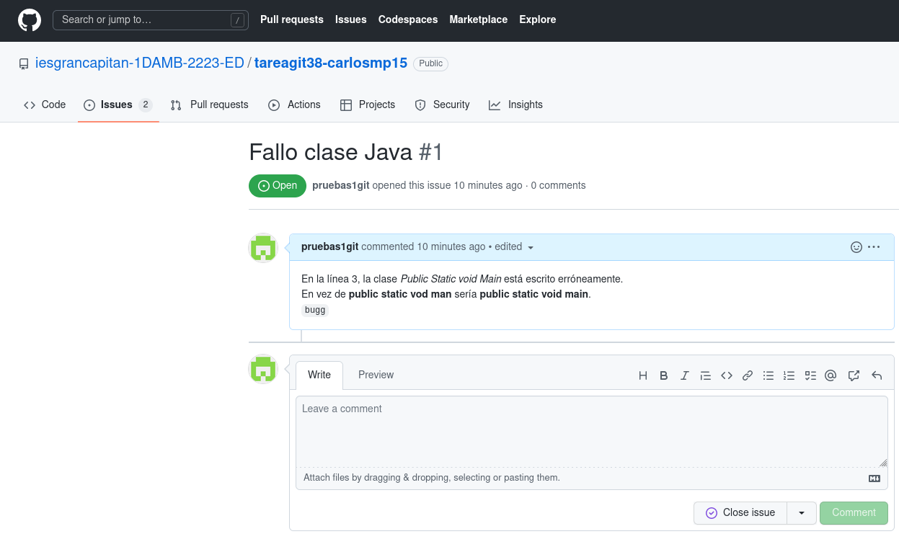
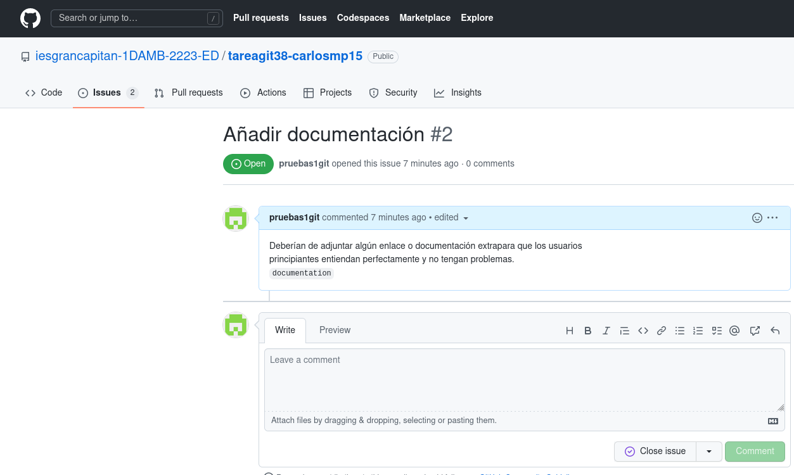
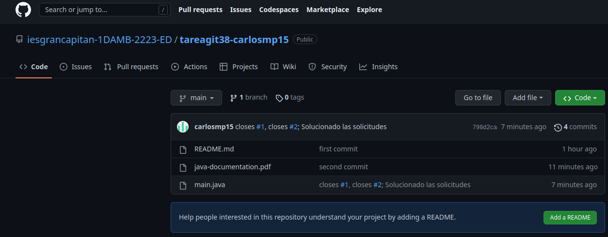
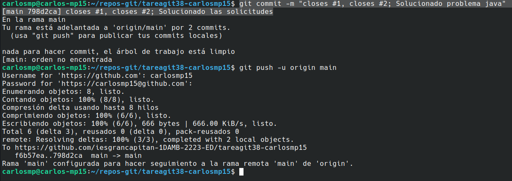
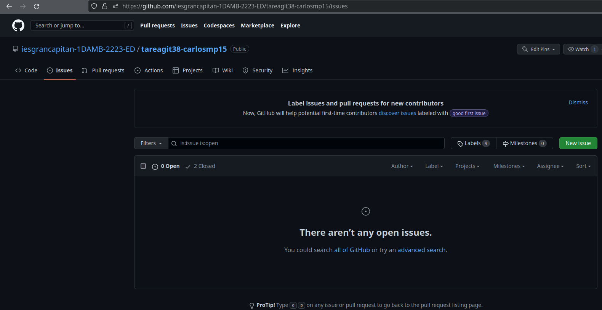

## TAREA GIT 3.8

**1)**
Creamos dos Issues con otra cuenta diferente a la nuestra sobre el repositorio.

Indicamos el fallo del problema.

**2)**
Añadimos al repositorio los cambios de la solicitud del problema.

Añadimos la documentación solicitada.

**3)**
Para eliminar los issues ejecutamos desde la terminal

**4)**
Si accedemos de nuevo a los Issues veremos como se han eliminado

correctamente y se ha añadido en el repo el mensaje que hemos introducido.

